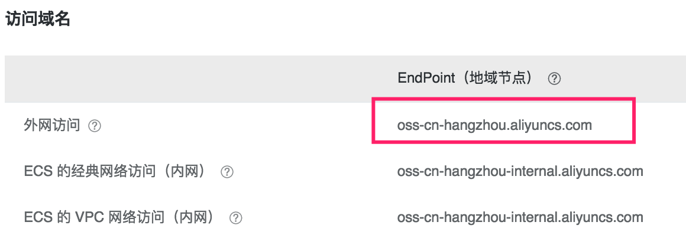
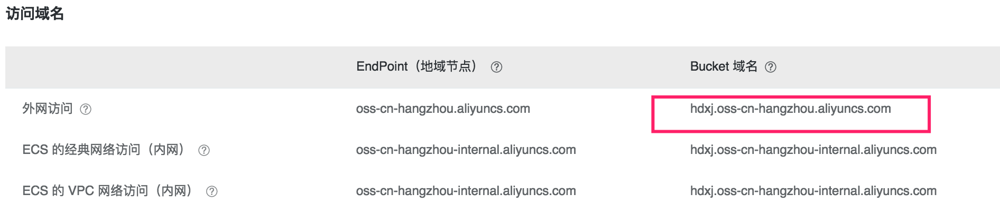

# 阿里云OSS
本服务用于管理阿里云OSS,本服务是对阿里云SDK的封装，所以方法名与阿里的SDK一样，下面是列举出的几个使用方法，其他OSS方法都是可以使用的，请参考阿里云 [OSS参考文档](https://help.aliyun.com/document_detail/32103.html?spm=5176.doc32099.6.748.85Qz6b)。
## 安装

使用 composer 命令进行安装或下载源代码使用。

```
composer require houdunwang/oss
composer require houdunwang/config
```

## 配置
|   配置 | 查看   |
| --- | --- |
| accessId |  登录阿里云后台https://ram.console.aliyun.com/查看右上角的 "访问控制(使用子帐号)" 或 "accesskeys(使用主帐号)"  |
| accessKey |  同上 accessId  |
| bucket | Bucket块名称 https://oss.console.aliyun.com/index |
| endpoint | 阿里云块 EndPoint |
| host | 外网域名比如会在前端上传获取上传签名时使用 |

```
\houdunwang\config\Config::set('oss',[
    'accessId'      => '',
    'accessKey'     => '',
    'bucket'        => 'hdxj',
    'endpoint'      => 'http://oss-cn-hangzhou.aliyuncs.com',
    'host'          => 'http://hdxj.oss-cn-hangzhou.aliyuncs.com',
]);
```

## 文件上传
```
//储存到阿里云文件名
$object = "1.mp4";
//本地文件
$filePath = '/www/1.mp4';
\houdunwang\config\Oss::uploadFile($object, $filePath);
```
## 字符串

```
$object = "hd.txt";
$content = "Hi, OSS.";
\houdunwang\config\Oss::putObject($object, $content);
```

## 签名

签名用于前台上传时使用.

```
\houdunwang\oss\Oss::sign();
die($sign)
```

